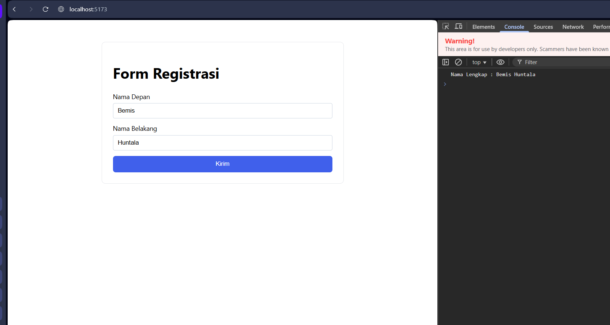

# registrasi_form_js1

A small Vue 3 + Vite demo app that contains a simple registration form.

## About this app

The app shows a registration form with two fields:

- `Nama Depan` (first name)
- `Nama Belakang` (last name)

When the user fills the fields and clicks the submit button, the app writes a single line to the browser console in this format:

```
Nama Lengkap : [Nama Depan] [Nama Belakang]
```

This repository includes a screenshot of the result at `src/assets/hasil.png`.

## How to run

1. Install dependencies:

```powershell
npm install
```

2. Start the dev server:

```powershell
npm run dev
```

3. Open the app in your browser (Vite will print the local URL, typically `http://localhost:5173`).

4. Open the browser Developer Tools Console to see the output when you submit the form.

## Interaksi dengan form (Cara pakai)

1. Isi kolom `Nama Depan`.
2. Isi kolom `Nama Belakang`.
3. Klik tombol `Kirim`.
4. Buka Console (Developer Tools) — Anda akan melihat satu baris seperti:

```
Nama Lengkap : Budi Santoso
```

Catatan: Form menggunakan `preventDefault` pada submit sehingga halaman tidak akan reload.

## Hasil (screenshot)

Di bawah ini adalah gambar contoh hasil interaksi (termasuk console). Jika Anda ingin melihat gambar secara lokal, buka `src/assets/hasil.png`.



## Recommended IDE & Browser Setup

- VS Code + Vue tooling (Volar)
- A Chromium-based browser with Vue devtools (optional)

## Lain-lain — Perintah berguna

- Build untuk produksi:

```powershell
npm run build
```

- Jalankan unit tests (Vitest):

```powershell
npm run test:unit
```

- Lint code:

```powershell
npm run lint
```

